# Курсовой проект MLOps
## Половников Никита

Курсовой проект по минимальному жизненному циклу ML-модели с использованием ClearML

Проект реализует классификацию тональности текста:

- подготовка и версионирование датасета в ClearML Dataset
- удаленное обучение через ClearML Agent
- логирование гиперпараметров, метрик и артефактов
- публикация модели в ClearML Model Registry
- запуск HTTP inference endpoint
- пользовательский интерфейс на Streamlit

## Структура проекта

```text
.
├── app.py              # Streamlit UI
├── serve.py            # FastAPI inference endpoint
├── train.py            # обучение модели через ClearML Agent
├── upload_dataset.py   # загрузка датасета в ClearML Dataset
├── publish_model.py    # публикация модели в ClearML Model Registry
└── sst2.csv            # локальная копия датасета
```

Для запуска нужно создать окружение и установить зависимости:

```powershell
pip install clearml clearml-agent datasets pandas scikit-learn matplotlib fastapi uvicorn streamlit requests
```

##  Подготовка инфраструктуры ClearML

### Запуск ClearML Server

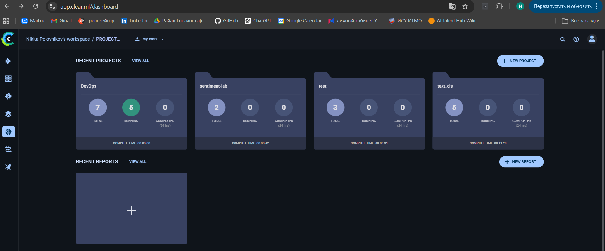

### Настройка ClearML SDK

Настроить подключение SDK к ClearML Server:

```powershell
clearml-init
```

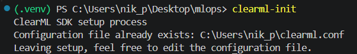

### Запуск ClearML Agent

Проект использует очередь `students`.

Запуск агента:

```powershell
  clearml-agent daemon --queue students
```


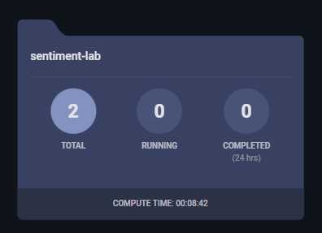

## Этап 1. Dataset в ClearML

Скрипт `upload_dataset.py`:

- скачивает часть датасета SST-2
- сохраняет данные в `sst2.csv`
- создает ClearML Dataset
- добавляет файл датасета
- фиксирует версию через `finalize(auto_upload=True)`

Запуск:

```powershell
python upload_dataset.py
```

После выполнения скрипт выводит `Dataset ID`

Этот ID используется в `train.py`:

```python
ds = Dataset.get(dataset_id="c5d80e5044f4473f805f5c910ffc498c")
```

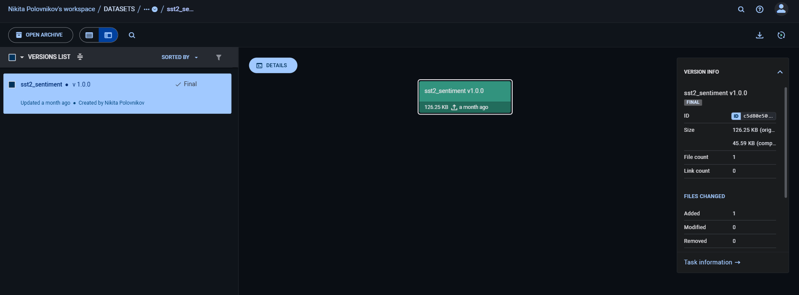

## Этап 2. Обучение через ClearML Agent

Скрипт `train.py`:

- создает ClearML Task в проекте `sentiment-lab`
- отправляет задачу в очередь `students`
- получает датасет из ClearML по `dataset_id`
- обучает модель `LogisticRegression`
- логирует гиперпараметры
- логирует метрики `accuracy` и `f1`
- логирует confusion matrix
- сохраняет модель как artifact `model.pkl`

Запуск обучения:

```powershell
python train.py
```
Отправка задачи в очередь ClearML Agent, т.к. обучение должно выполняться агентом, а не локально

```python
task.execute_remotely(queue_name="students")
```


В `train.py` уже есть два набора параметров:

Эксперимент 1:

```python
{
    "C": 1.0,
    "max_iter": 200,
    "max_features": 5000
}
```

Эксперимент 2:

```python
{
    "C": 0.1,
    "max_iter": 200,
    "max_features": 10000
}
```

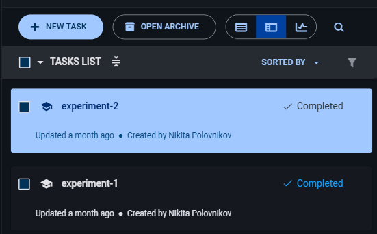

| Experiment 1 | Experiment 2 | 
|----------|----------|
|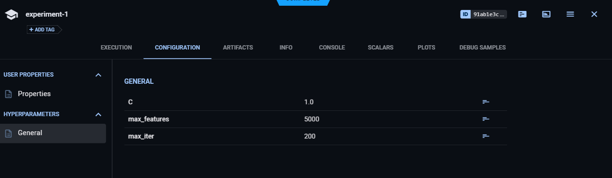  | 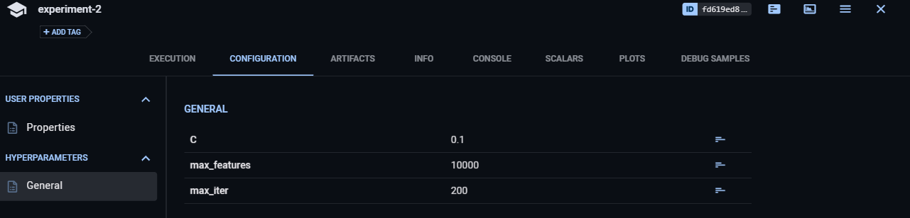|
| 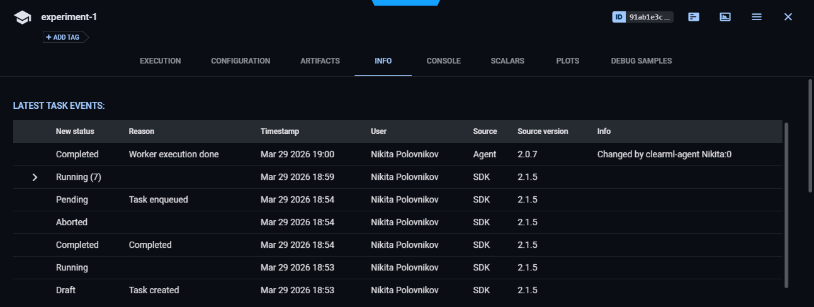  | 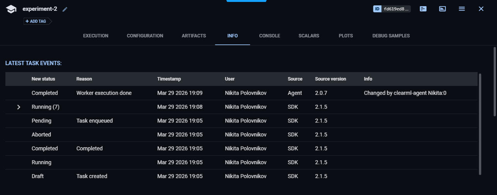  |
| 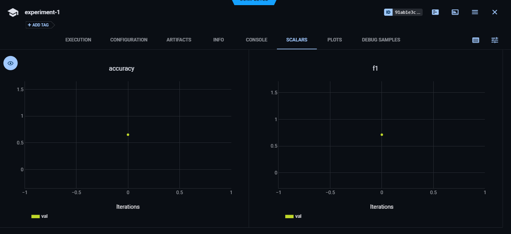  |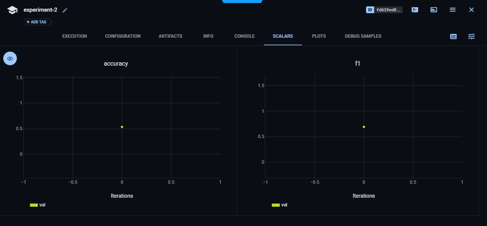  |
| 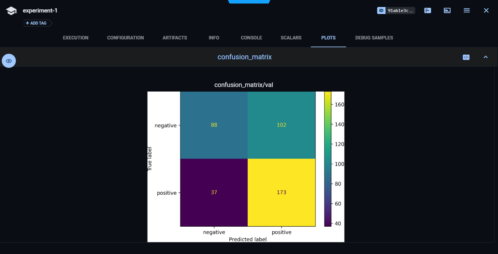 | 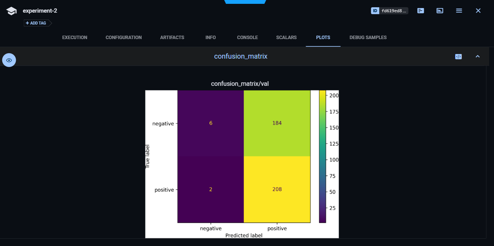|


## Этап 3. Model Registry

После выбора лучшего эксперимента модель публикуется в ClearML Model Registry

В `publish_model.py` используется task с artifact модели:

```python
task = Task.get_task(task_id="91ab1e3cfdf54f16af7da1ace04ae814")
```

Публикация модели:

```powershell
python publish_model.py
```

Скрипт:

- получает artifact `model` из выбранного task
- создает `OutputModel`
- добавляет имя, framework и теги
- публикует модель
- выводит `Model ID`

Полученный `Model ID` используется в inference endpoint

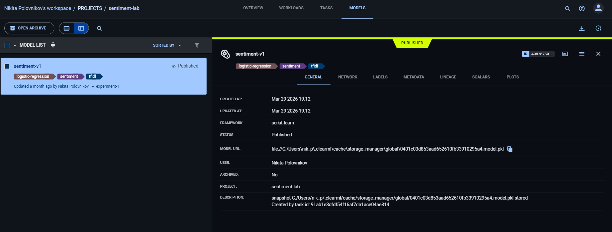

## Этап 4. Inference Endpoint

В проекте inference endpoint реализован через FastAPI

Скрипт `serve.py`:

- загружает модель из ClearML по `model_id`
- поднимает HTTP endpoint
- принимает текст
- возвращает predicted label и confidence

Текущий `model_id`:

```python
model_obj = Model(model_id="40828760798b4198b0c09e6407af06a4")
```

Запуск endpoint:

```powershell
uvicorn serve:app --host 127.0.0.1 --port 8000
```

Проверка health endpoint:

```powershell
Invoke-RestMethod http://127.0.0.1:8000/health
```

Пример запроса для positive class:

```powershell
Invoke-RestMethod -Method Post `
  -Uri http://127.0.0.1:8000/predict `
  -ContentType "application/json" `
  -Body '{"text":"this movie is great and very enjoyable"}'
```

Пример запроса для negative class:

```powershell
Invoke-RestMethod -Method Post `
  -Uri http://127.0.0.1:8000/predict `
  -ContentType "application/json" `
  -Body '{"text":"this movie is boring and terrible"}'
```

Ожидаемый формат ответа:

```json
{
  "label": "positive",
  "confidence": 0.95
}
```

## Этап 5. Streamlit UI

UI реализован в `app.py`

Он:

- содержит поле ввода текста
- содержит кнопку `Predict`
- отправляет HTTP-запрос на endpoint
- отображает label
- отображает confidence
- отображает latency
- показывает ошибку, если endpoint недоступен

Перед запуском UI должен быть запущен inference endpoint:

```powershell
uvicorn serve:app --host 127.0.0.1 --port 8000
```

Запуск Streamlit:

```powershell
streamlit run app.py
```

UI будет доступен по адресу:

```text
http://localhost:8501
```

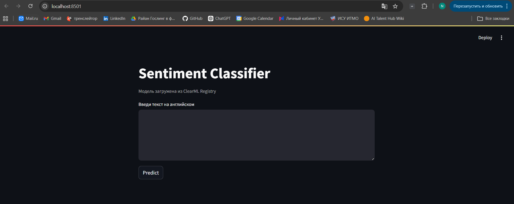

| negative | positive | 
|----------|----------|
|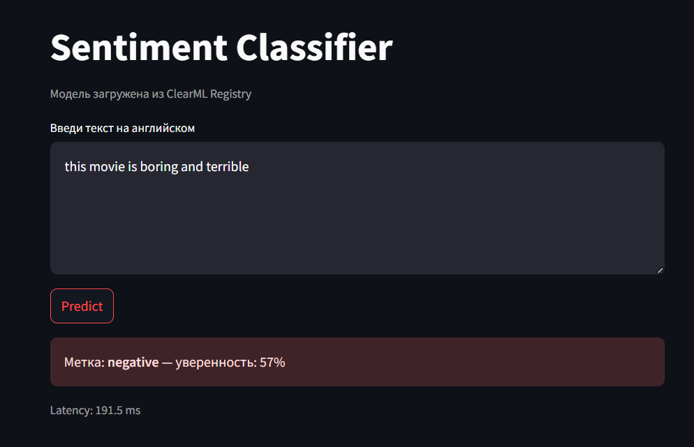| 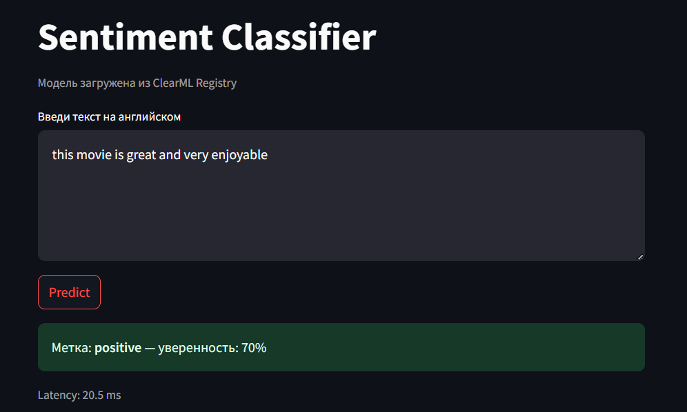|